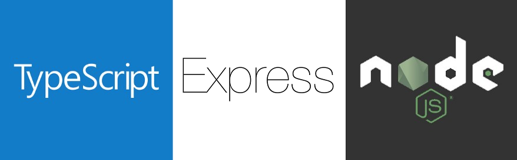

<h2 align="center">
  Sistema para pedidos de comidas.
</h2>

## 🚀 Sobre

---

## 💻 Tecnologias

- NodeJS
- Express
- TypeScript
- TypeORM
- Postgres
- Eslint
- Prettier
- Multer
  ...

---

## 🚀 Instalação e execução

1. Faça um clone do repositório;
2. Entre na pasta do projeto pelo terminal;
3. Rode `yarn` para instalar as dependências;
4. Rode `yarn dev:server` para iniciar o servidor de desenvolvimento;
